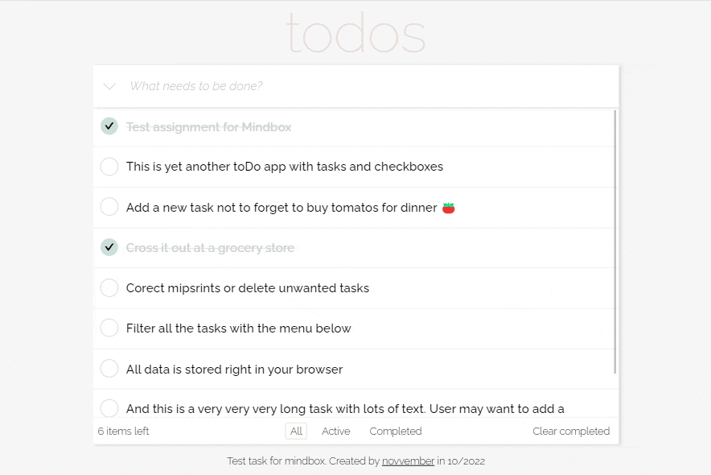
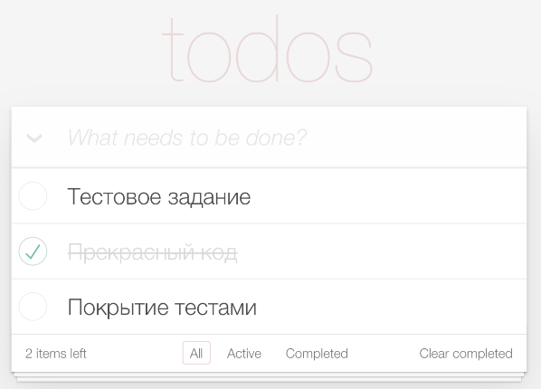

# todos

ToDo-приложение, позволяющее управлять текущим списком дел

## 👀 Демо: [`novvember.github.io/mindbox-todos/`](http://novvember.tk/mindbox-todos/)

## Возможности

- [x] Адаптивная верстка с расчетом на весь экран мобильного устройства
- [x] Добавление задачи
- [x] Возможность вычернуть задачу (отметить как сделанную)
- [x] Фильтр задач
- [x] Возможность удалить выполненные задачи
- [x] Редактирование/удаление задачи
- [x] Хранение всех задач в браузере (Local Storage)
- [x] Юнит-тестирование компонентов

## Стек

- React.js
- Create React App
- TypeScript
- BEM
- LocalStorage
- Jest + React Test Library

## Задание ([ссылка](https://docs.google.com/document/d/1X9zMnAAU9vvEzdYtSEeeram8Kur5o-py5ChKlK5TIa8/edit#))

Это тестовое задание для Mindbox на позицию Frontend intern.

1. Сделайте ToDo-приложение, позволяющее управлять текущим списком дел

2. Что должно быть в интерфейсе:

- Поле для ввода новой задачи
- Списки всех задач, невыполненных и выполненных задач (по отдельности)

3. Пример внешнего вида приложения  
   

4. Требования к коду:

- Приложение создано с использованием TypeScript, React и React Hooks
- Библиотеки компонент – на ваше усмотрение
- Ключевая на ваш взгляд функциональность обязательно покрыта тестами
- Проект должен запускаться командой npm i && npm run start
- Опционально: проект доступен на GitHub Pages/Vercel/etc.

## Статус разработки

✅ _Готово_
